# Diagram Mermaid Backend

Dokumen ini berisi diagram Mermaid yang menggambarkan cara kerja backend FastAPI pada proyek ini. Diagram disusun berdasarkan struktur kode di `app/main.py`, modul `app/modules/*`, SQLAlchemy model, service, repository, middleware, autentikasi JWT, upload file, timeline pesanan, audit log, dan dashboard.

## 1. Use Case Diagram

Diagram ini menggambarkan aktor utama dan fitur backend yang mereka pakai.

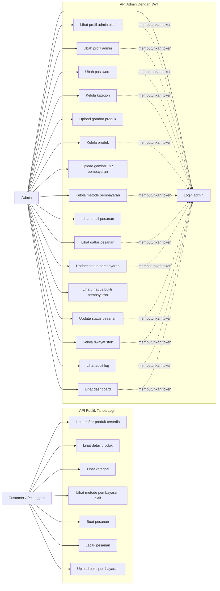

## 2. Arsitektur Backend

Diagram ini menunjukkan jalur request dari client sampai database dan storage.

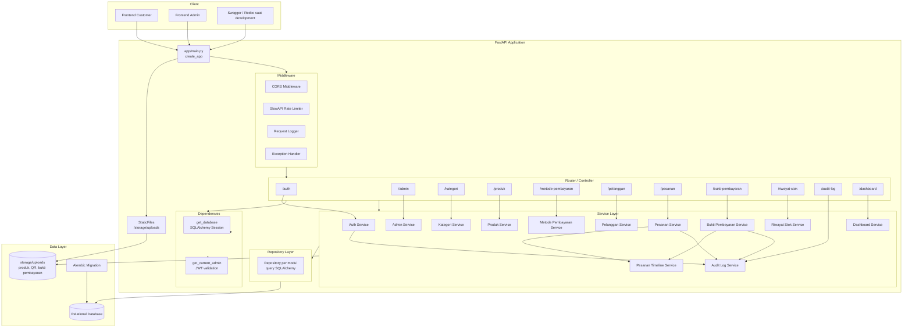

## 3. ERD Database

Diagram ini mengikuti model SQLAlchemy dan migration Alembic.

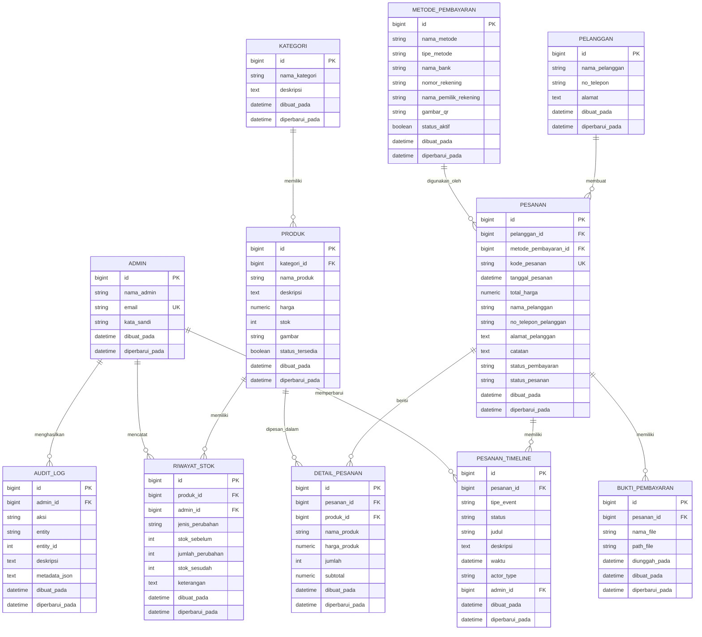

## 4. Sequence Diagram Buat Pesanan

Diagram ini menggambarkan endpoint `POST /pesanan`.

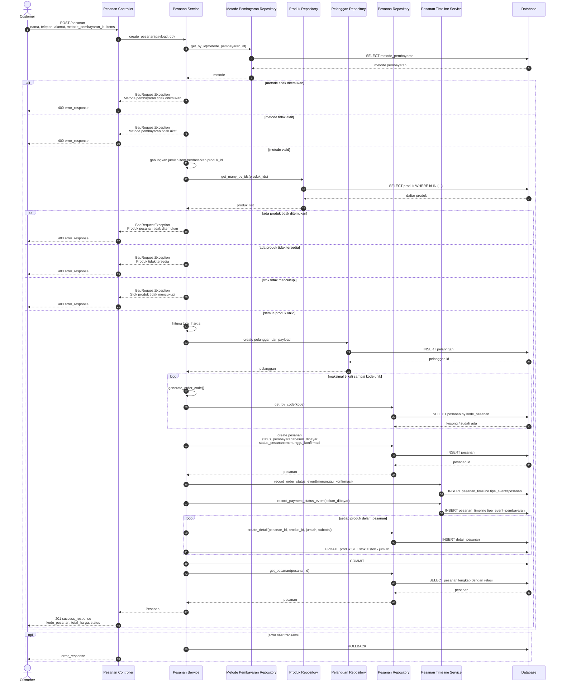

## 5. Sequence Diagram Upload Bukti Pembayaran

Diagram ini menggambarkan endpoint `POST /bukti-pembayaran/upload-tanpa-login`.

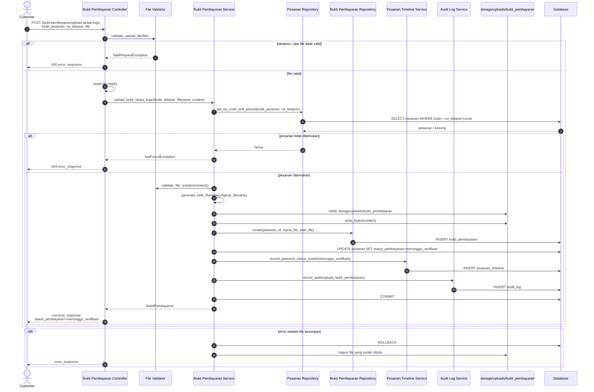

## 6. Sequence Diagram Login Admin dan Akses API Admin

Diagram ini menggambarkan `POST /auth/login` dan dependency `get_current_admin`.

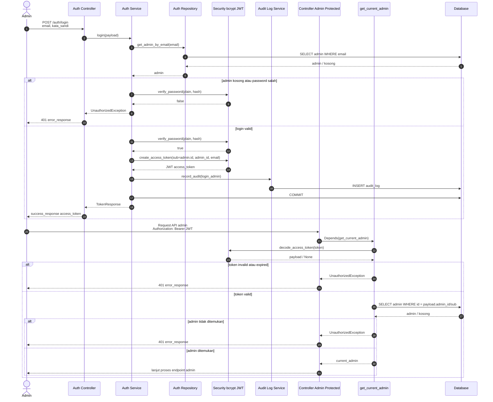

## 7. Sequence Diagram Admin Update Status Pesanan dan Pembayaran

Diagram ini menggambarkan endpoint `PATCH /pesanan/{id}/status-pembayaran` dan `PATCH /pesanan/{id}/status-pesanan`.

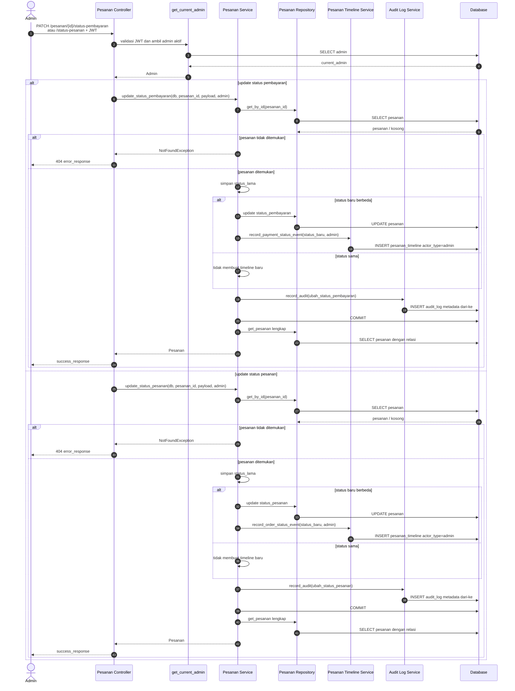

## 8. State Diagram Status Pesanan

Diagram ini menjelaskan lifecycle `status_pesanan`.

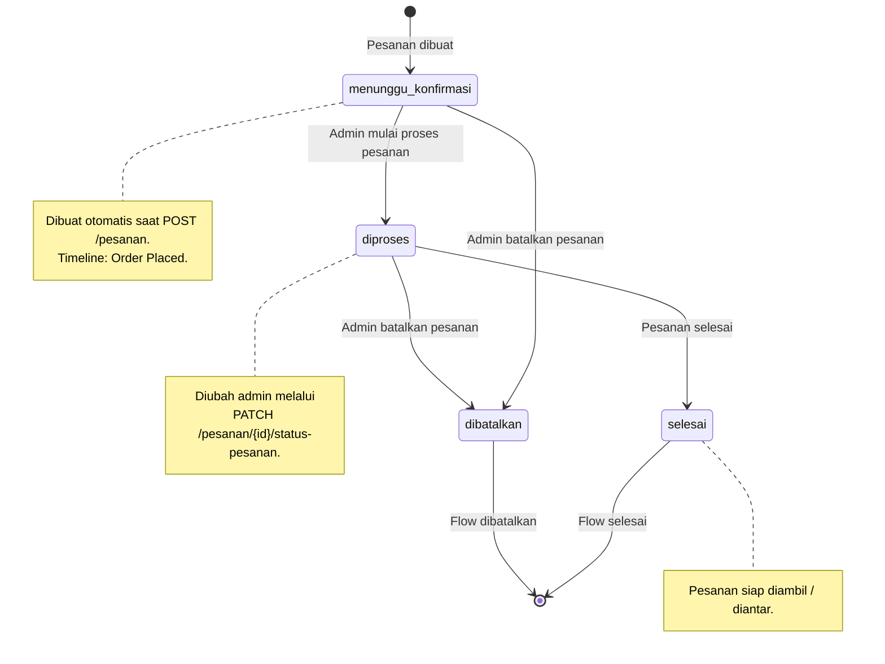

## 9. State Diagram Status Pembayaran

Diagram ini menjelaskan lifecycle `status_pembayaran`.

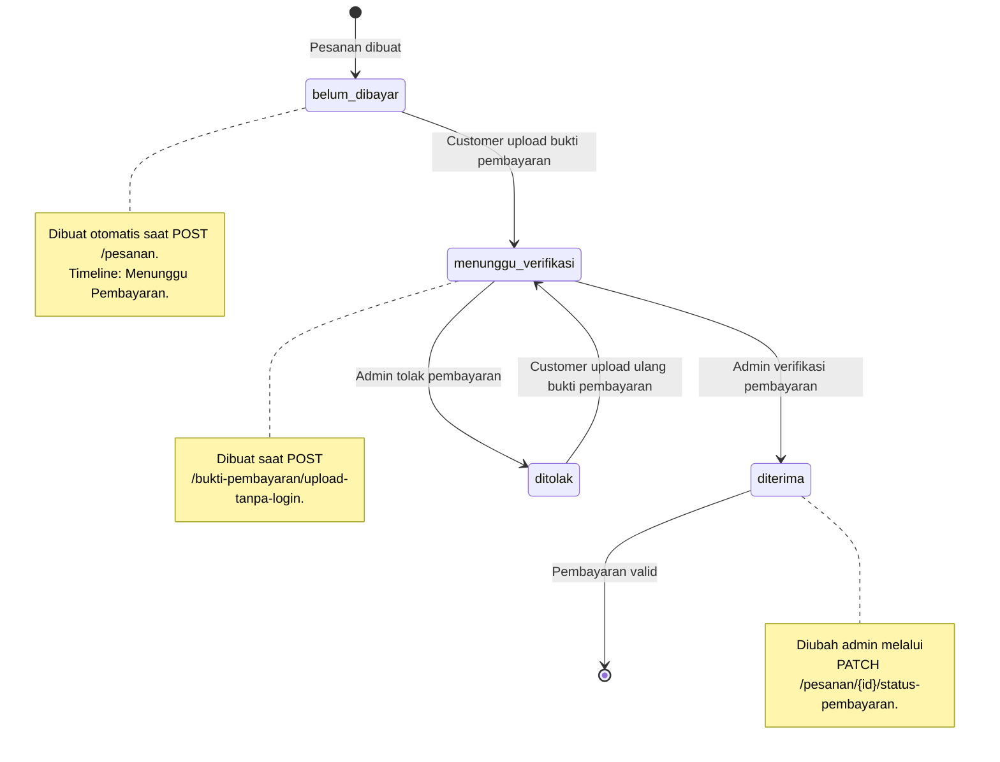

## 10. Sequence Diagram Kelola Stok Produk

Diagram ini menggambarkan endpoint `POST /riwayat-stok`.

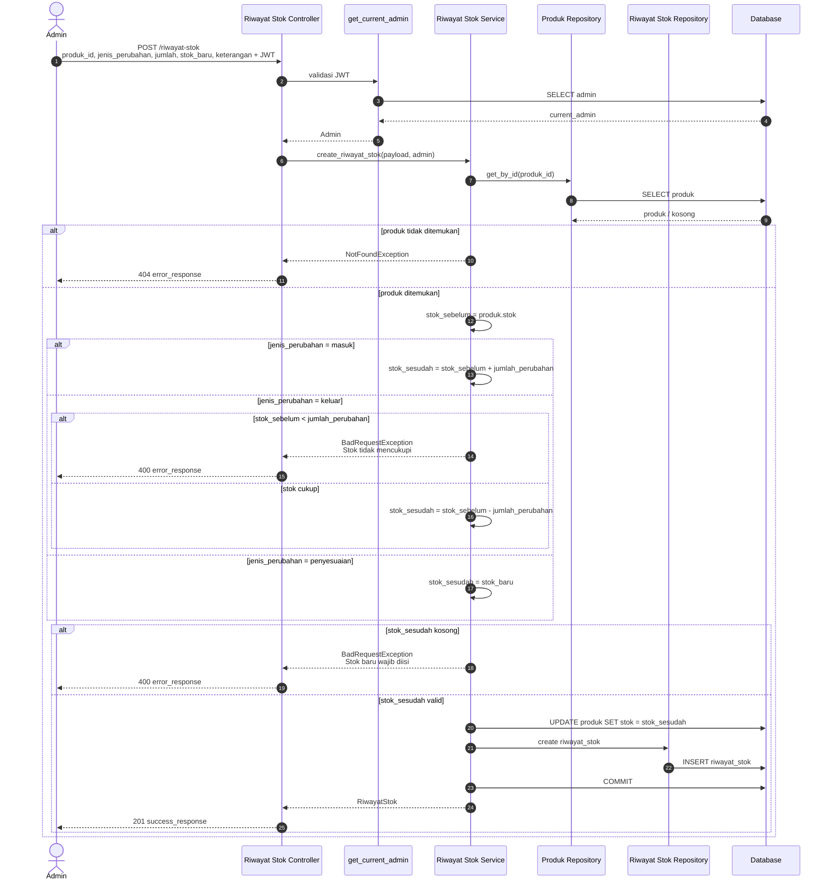

## 11. Data Flow Dashboard

Diagram ini menggambarkan endpoint dashboard yang membaca agregasi dari beberapa tabel.

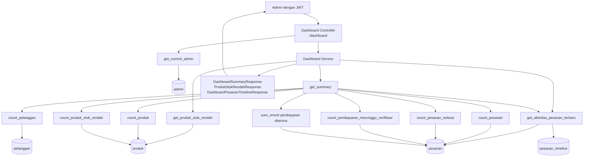

## 12. Deployment Diagram

Diagram ini menggambarkan komponen runtime sistem.

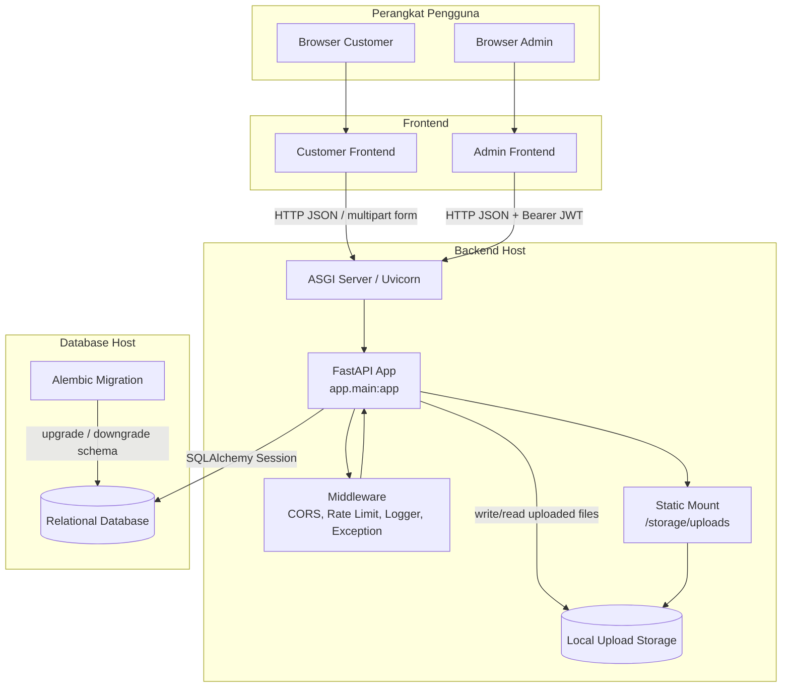
